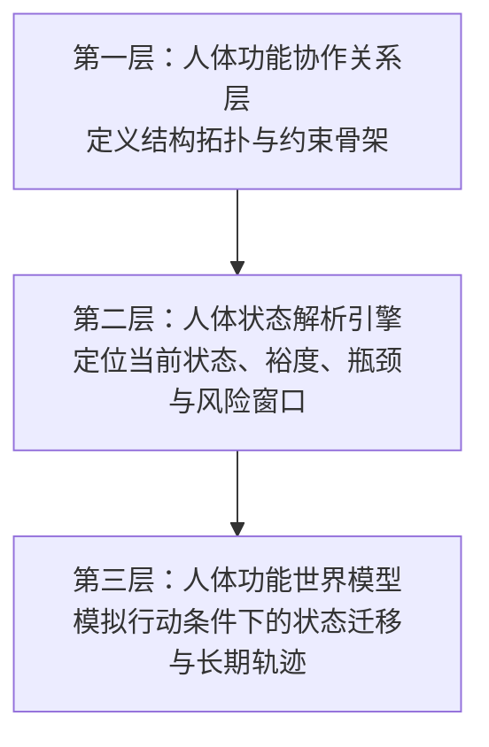
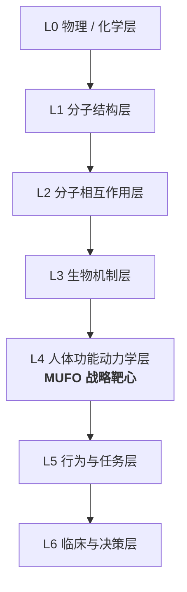
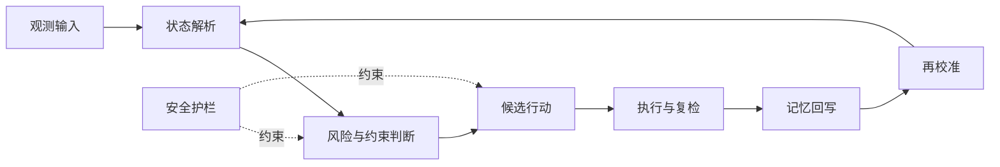

````md
# 图示说明

本文档收录 MUFO 仓库中使用的核心图示。  
在 GitHub 发布阶段，优先使用 Mermaid 图，以保证图示可编辑、可版本管理、易于维护。

---

## 图 1：人体功能知识碎片化结构图

**用途**  
说明当前人体功能知识仍然分散在解剖、功能、任务、评估、干预与记录之中，缺乏统一的可计算坐标系。

```mermaid
flowchart TB
    C["缺少统一的可计算坐标系"]

    A1["解剖"]
    A2["功能"]
    A3["任务 / 动作"]
    A4["评估"]
    A5["干预"]
    A6["记录 / 数据"]

    A1 --> C
    A2 --> C
    A3 --> C
    A4 --> C
    A5 --> C
    A6 --> C
````

**图注**
人体功能知识并非缺失，而是长期处于碎片化状态。真正的瓶颈在于缺乏一套统一、稳定、可计算的坐标系。

---

## 图 2：MUFO 的定位与边界

**用途**
说明 MUFO 是“人体功能世界”的知识与规则底座，同时明确它不是什么。

```mermaid
flowchart LR
    I1["概念"]
    I2["关系"]
    I3["约束"]
    I4["证据"]
    I5["治理"]

    M["MUFO = 人体功能世界的知识与规则底座"]

    O1["状态分析"]
    O2["风险边界"]
    O3["行动入口"]
    O4["可审计推理"]
    O5["纵向演化基础"]

    I1 --> M
    I2 --> M
    I3 --> M
    I4 --> M
    I5 --> M

    M --> O1
    M --> O2
    M --> O3
    M --> O4
    M --> O5
```

**图注**
MUFO 不是诊断引擎，也不是治疗协议。它的定位是：把人体功能表达为一个可计算、可推理、可治理的知识与规则系统。

---

## 图 3：MUFO 三层主结构图

**用途**
展示 MUFO 的三层主结构。



**图注**
MUFO 的演进路径是：先定义结构，再解析状态，最后在结构与状态之上引入时间、行动与记忆回写。

---

## 图 4：MUFO 在多尺度生物世界模型栈中的位置

**用途**
展示 MUFO 在更大范围的生物世界模型层级中的战略位置。



**图注**
MUFO 的核心目标不在分子结构或抽象决策总结，而在 L4：人体功能动力学层。这一层连接下层机制约束与上层任务表现和决策支持。

---

## 图 5：L5 任务结果 vs L4 功能动力学

**用途**
区分传统任务结果评价与 MUFO 所关注的功能动力学层。


**图注**
许多传统量表停留在“任务能否完成”的层面，而 MUFO 试图向下进入“功能如何支撑任务完成、风险如何被约束”的层面。

---

## 图 6：行动—状态—记忆回写闭环图

**用途**
展示人体功能世界模型的最小闭环。



**图注**
一个真正的人体功能世界模型，不能停留在“给出建议”。它必须包含护栏、执行、复检、回写与再校准，形成可持续更新的闭环。

---


