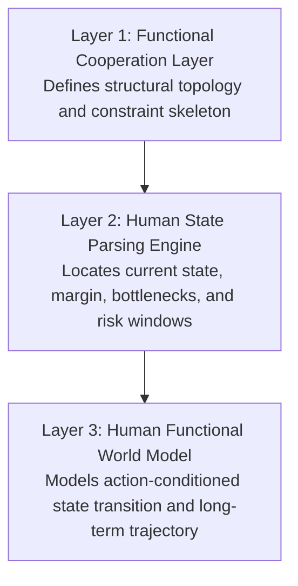
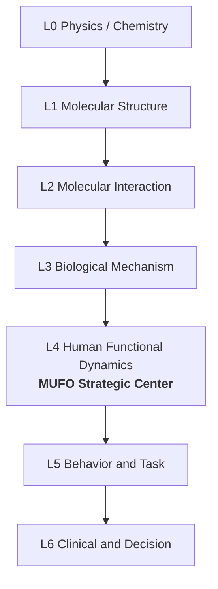
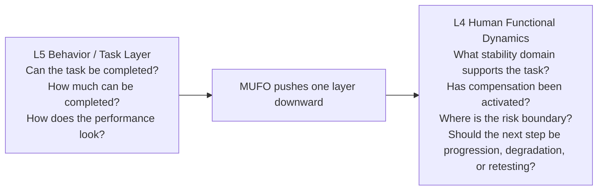
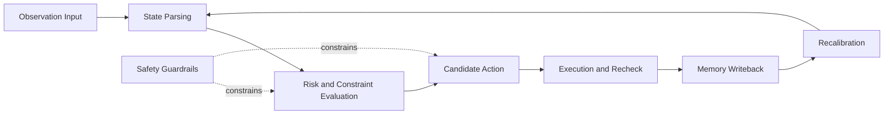

````md
# Figures

This document contains the core figures used by the MUFO repository.  
For GitHub publishing, Mermaid diagrams are used first so that the figures remain editable, versionable, and easy to maintain.

---

## Figure 1. Fragmentation of Human Function Knowledge

**Purpose**  
To show that human-function knowledge is still split across anatomy, function, task, assessment, intervention, and records, without a unified computable coordinate system.

```mermaid
flowchart TB
    C["Lack of a unified computable coordinate system"]

    A1["Anatomy"]
    A2["Function"]
    A3["Task / Movement"]
    A4["Assessment"]
    A5["Intervention"]
    A6["Records / Data"]

    A1 --> C
    A2 --> C
    A3 --> C
    A4 --> C
    A5 --> C
    A6 --> C
````

**Caption**
Human-function knowledge is not absent; it is fragmented. The central bottleneck is the absence of a unified computable coordinate system.

---

## Figure 2. MUFO Position and Boundary

**Purpose**
To define MUFO as the knowledge-and-rules substrate of the human functional world, while clarifying what it is not.

```mermaid
flowchart LR
    I1["Concepts"]
    I2["Relations"]
    I3["Constraints"]
    I4["Evidence"]
    I5["Governance"]

    M["MUFO = Knowledge-and-rules substrate for the human functional world"]

    O1["State analysis"]
    O2["Risk boundaries"]
    O3["Action entry points"]
    O4["Auditable reasoning"]
    O5["Longitudinal evolution basis"]

    I1 --> M
    I2 --> M
    I3 --> M
    I4 --> M
    I5 --> M

    M --> O1
    M --> O2
    M --> O3
    M --> O4
    M --> O5
```

**Caption**
MUFO is not a diagnosis engine or a treatment protocol. It is the structured substrate for representing and reasoning about human function.

---

## Figure 3. The Three-Layer MUFO Architecture

**Purpose**
To present the main architecture of MUFO.



**Caption**
MUFO develops from structural topology to state parsing, and then from state parsing to action-conditioned functional world modeling.

---

## Figure 4. MUFO in the Multi-Scale Biological World-Model Stack

**Purpose**
To show MUFO’s strategic position in the broader biological world-model hierarchy.



**Caption**
MUFO is not centered on molecular structure or generic decision summaries. Its strategic target is L4: Human Functional Dynamics.

---

## Figure 5. L5 Task Outcome vs L4 Functional Dynamics

**Purpose**
To distinguish ordinary task-result evaluation from MUFO’s deeper focus on functional dynamics.



**Caption**
Many traditional scales stop at task completion. MUFO pushes downward into the functional-dynamics layer.

---

## Figure 6. Action–State–Memory Feedback Loop

**Purpose**
To illustrate the minimum closed loop of the human functional world model.



**Caption**
A functional world model does not stop at recommendation. It must include guardrails, execution, recheck, writeback, and recalibration.

---
